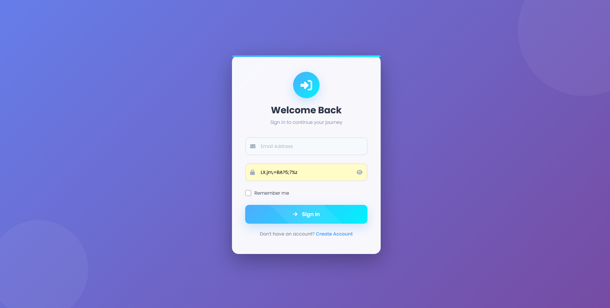
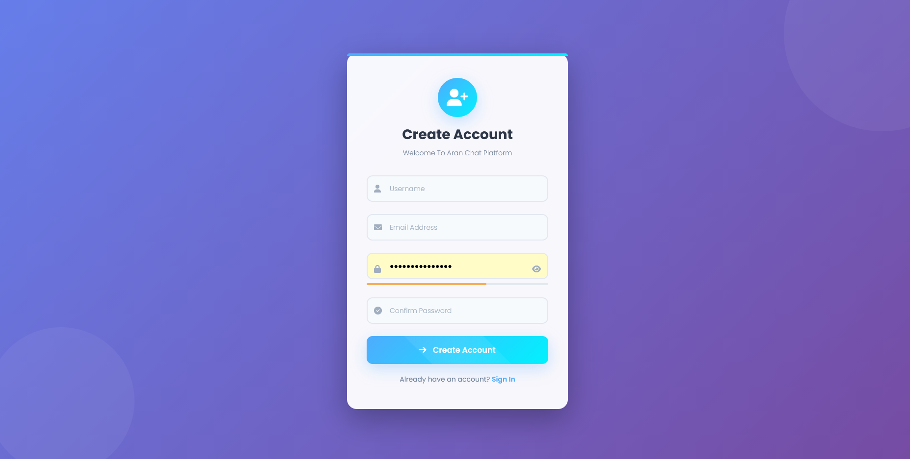
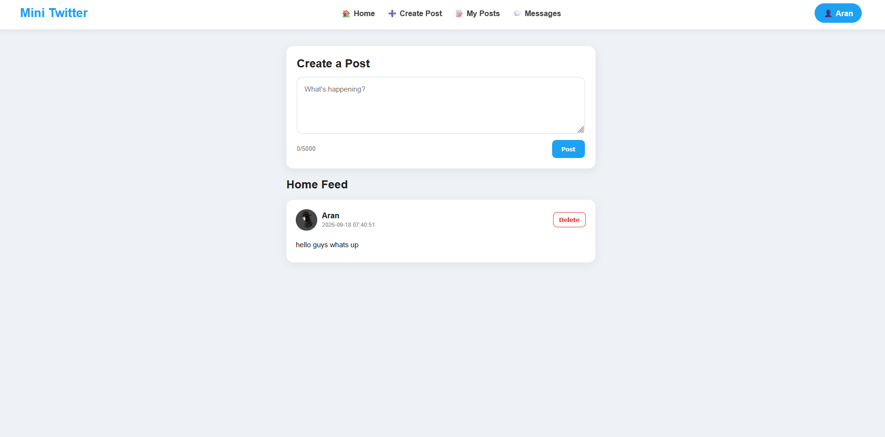
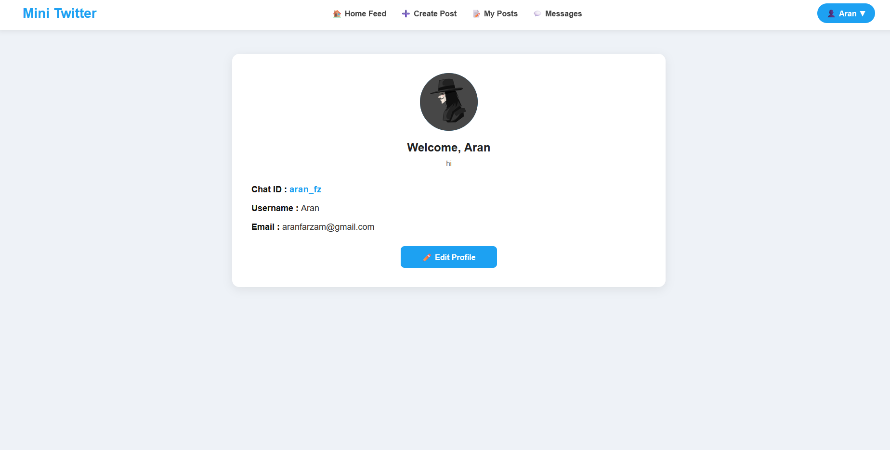
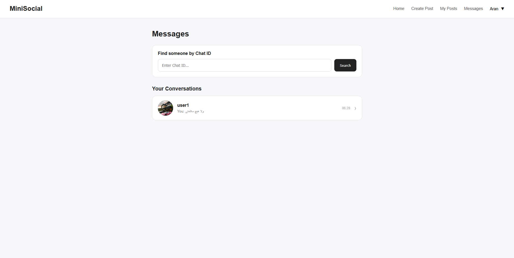

# Social Media Platform

A full-stack social media web application built with PHP, MySQL, JavaScript, HTML, CSS, and WebSocket.

This project was developed as a practical full-stack application to explore user authentication, profile management, database-driven content, real-time communication, and basic web application security.

---

## 📸 Screenshots

### 🔐 Login



---

### 📝 Register



---

### 🏠 Home Feed



---

### 👤 User Profile



---

### 💬 Real-Time Chat



---

## ✨ Features

### 🔐 Authentication
- User registration
- User login and logout
- Secure password hashing
- Session-based authentication
- Input validation

### 👤 User Profiles
- View user profile
- Edit profile information
- Custom bio
- Avatar upload
- Unique public Chat ID

### 📝 Posts & Feed
- Create posts
- Display posts in a dynamic feed
- View your own posts
- Delete your own posts
- Database-driven post system

### 💬 Real-Time Messaging
- Private user-to-user messaging
- Search users using their unique Chat ID
- Persistent message history
- Real-time message delivery
- WebSocket communication using Ratchet

### 🗄️ Database
- MySQL database
- PDO
- Prepared statements
- Foreign key relationships
- Database indexes
- Cascading deletes

### 🛡️ Security
- Password hashing with `password_hash()`
- PDO prepared statements
- Session-based access control
- CSRF protection for post operations
- Output escaping to reduce XSS risks
- Server-side input validation

---

## 🛠️ Tech Stack

| Technology | Usage |
|---|---|
| PHP | Backend & server-side logic |
| MySQL | Database |
| JavaScript | Client-side functionality |
| HTML5 | Application structure |
| CSS3 | User interface |
| WebSocket | Real-time communication |
| Ratchet | PHP WebSocket server |
| PDO | Secure database access |
| Composer | Dependency management |

---

## 🏗️ Project Structure

```text
social-media-platform/
│
├── public/
│   ├── index.php
│   ├── auth/
│   │   ├── login.php
│   │   ├── register.php
│   │   └── logout.php
│   │
│   ├── profile/
│   │   ├── profile.php
│   │   └── edit-profile.php
│   │
│   └── messages/
│       ├── messages.php
│       └── chat.php
│
├── api/
│   ├── messages/
│   │   └── get-chat.php
│   │
│   └── posts/
│       ├── create.php
│       ├── feed.php
│       └── delete.php
│
├── config/
│   └── database.php
│
├── database/
│   └── schema.sql
│
├── websocket/
│   └── server.php
│
├── uploads/
│   └── avatars/
│
├── screenshots/
│
├── vendor/
│
├── composer.json
├── composer.lock
├── .gitignore
└── README.md
